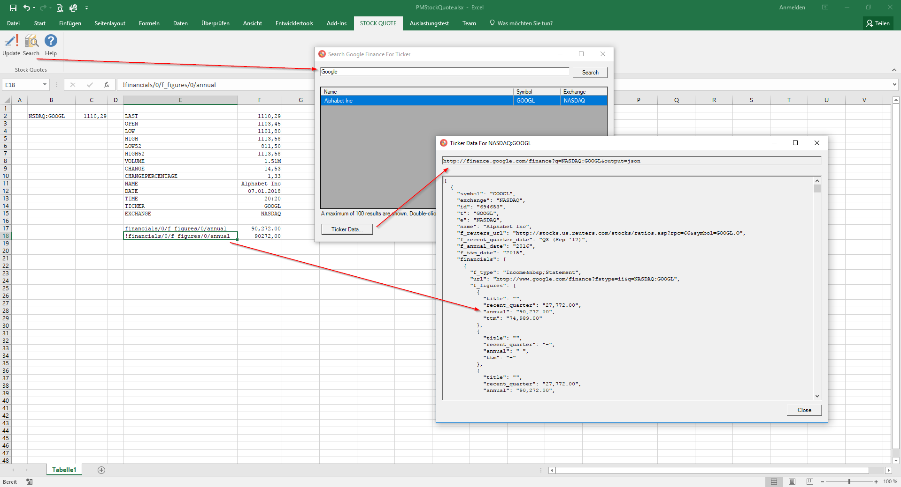
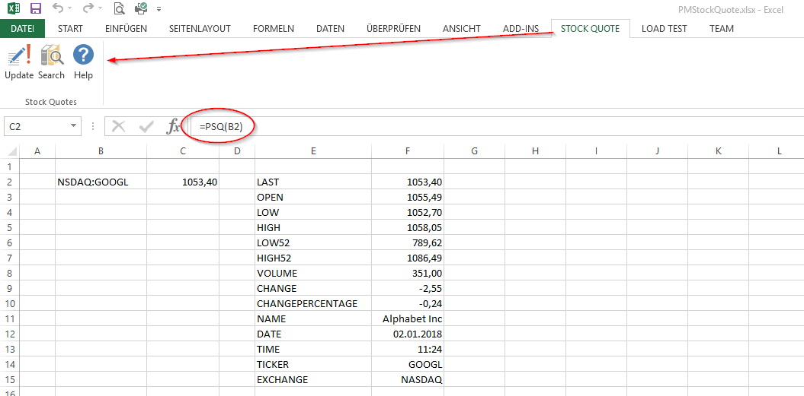

# PMStockQuote

**RELEASE**

Stock Quote Add-In For Excel 2018 R2 
https://github.com/jbaurle/PMStockQuote/releases/tag/Stock_Quote_Add-In_For_Excel_2018_R2

To install the version download PMStockQuote.zip, extract the archive file and call either Install32.bat or Install64.bat depending on the Excel version (32/64-bit) installed on your computer. [What version of Office am I using?](https://support.office.com/en-us/article/About-Office-What-version-of-Office-am-I-using-932788b8-a3ce-44bf-bb09-e334518b8b19)

**Stock Quote Add-In For Excel 2016 and 2013**

The Stock Quote Add-In For Excel 2016/2013 is a small add-in based on the fantastic Excel-DNA library to retrieve stock data from Google Finance using the PSQ function. This version is using the Google Finance API. The old Stock Quote add-in was using the Yahoo Finance API to retrieve the stock quotes. The service has been terminated by Yahoo on 11/01/2017.

**Usage**

The add-in is providing an Excel function called **PSQ** to retrieve stock data like open, last, low, high or name for the passed symbol. See the following formula samples:

* **=PSQ(A1;"PRICE")**, **=PSQ(A1;"CLOSE")**, **=PSQ(A1;"LAST")** or just **=PSQ(A1)**
* **=PSQ(A1;"OPEN")**
* **=PSQ(A1;"LOW")**
* **=PSQ(A1;"HIGH")**
* **=PSQ(A1;"LOW52")**
* **=PSQ(A1;"HIGH52")**
* **=PSQ(A1;"VOLUME")**
* **=PSQ(A1;"CHANGE")**
* **=PSQ(A1;"CHANGEPERCENTAGE")** or **=PSQ(A1;"CP")**
* **=PSQ(A1;"NAME")**
* **=PSQ(A1;"DATE")** => NOT last trade date, just date of last query
* **=PSQ(A1;"TIME")** => NOT last trade time, just time of last query
* **=PSQ(A1;"TICKER")** or **=PSQ(A1;"SYMBOL")**
* **=PSQ(A1;"EXCHANGE")**

DATE and TIME are the timestamp of the last query, not the last trade date. Google Finance API is not returning the this kind of data anymore.

The second screenshot shows how to use the item reference notation to access all available data. Starting from the root object we are new able to access for instance the first figure data with **financials/0/f_figures/0/annual**. This notation returns the value as string. To return the value as number, prefix the path with !. The notation is case-sensitive.

* **=PSQ("NASDAQ:GOOGL";"!financials/0/f_figures/0/annual")**
* **=PSQ("NASDAQ:GOOGL";"avvo")**
* **=PSQ("ETR:DAI";"management/1/name")**
* **=PSQ("MUTF:VTSAX";"!expense_ratio")**

**Screenshots**

German Edition of Excel 2016:

German Edition of Excel 2013:

**Links**

Stock Quote Add-In for Excel 2016 
[http://www.parago.de/pmstockquoteexceladdin/](http://www.parago.de/pmstockquoteexceladdin/)
